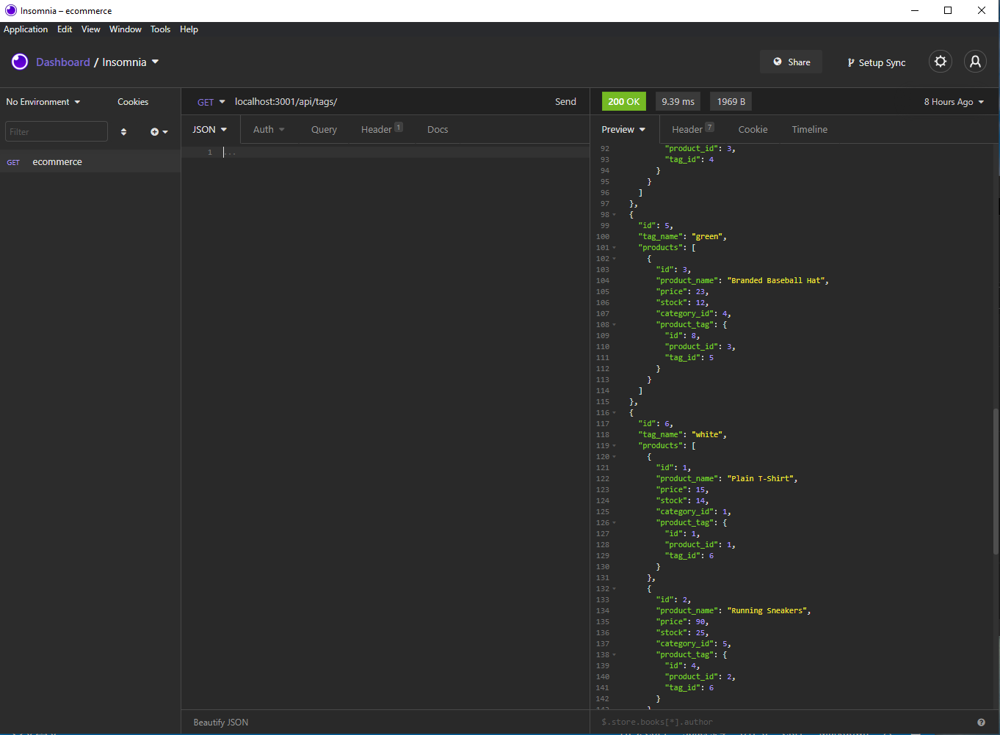
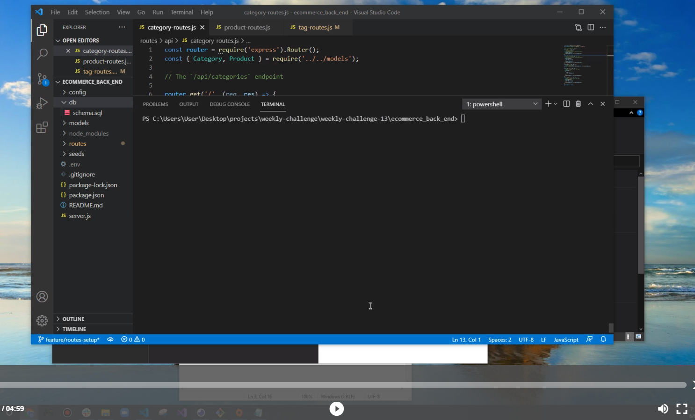

# E-commerce Back End Starter Code

## Description 

  A back end for an e-commerce website that uses the latest technologies
  such as Node.js, Express.js, MySQL2 and Sequelize Object Relational Mapper(ORM).

 
  

## Installation

  - Clone/Download the project
  - From the root directory in your terminal/command line run 'npm install'
  
## Usage 
  
  - For clarity, use the links below to watch a quick tutorial on how to use:
    - Video 1: https://drive.google.com/file/d/1EPOsR1G3Q3O66HUUJUcOfwymVy-s_tLw/view
    - Video 2: https://drive.google.com/file/d/1iqUcYbQ5I8EgCD9Ia_UwdKq3iYtSFPwW/view
    - Video 3: https://drive.google.com/file/d/1_mJwejQaSLJlNKvm3em0rvOzsupFpivP/view
    - Video 4: https://drive.google.com/file/d/1aDpmT5eeZr3etVPgCsQRI2ED1CJvmJSH/view
    - Video 5: https://drive.google.com/file/d/128U9KZrSAPY4aqIV86MQQU3FQR9NP-4q/view
  

## Questions
  - 👋 Hi, I’m dkbaffour777
  - GitHub profile link: [github.com/dkbaffour777/](https://github.com/dkbaffour777/)
  - 📫 How to reach, email: dkbaffour777career@gmail.com
